# **Paket ve Repo Yönetimi**

## Repo Kavramı
- Repolar, distroların paket dağıtım sunucularıdır. Güncellemer de repolar aracılığıyla yapılır.
- Her distronun kendine özgü resmi, resmi olmayan ve topluluk gibi repoları vardır.
- Her distro için birden fazla repo olabilir. Ve repolar seçilebilirler, eklenebilir, çıkarılabilirlerdir.
- Öntanımlı repolar Debian tabanlı distrolarda genellikle /etc/apt/sources.list dosyasındadır.
- Repolara erişimler, sisteme öntanımlı ve eklenebilir olan key’ler ile sağlanır. Her repo’nun key’i vardır.
Key’ler geçerliliğini veya güncelleğini kaybederse repo erişimi sağlanamaz.
Key’lere keyring adı da verilir; GPG uzantılıdırlar ve key server’lardan temin edilirler.


```
nano /etc/apt/source.list
```
Yukarıdaki komut ile /etc/apt/source.list dosyasını incelediğimizde repoların adreslerini görebiliyoruz.

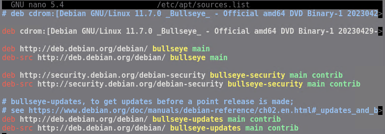


```
sudo apt-key list 
```
Yukarıdaki komut ile repolara erişim için kullanılan keyleri görüntüledik.

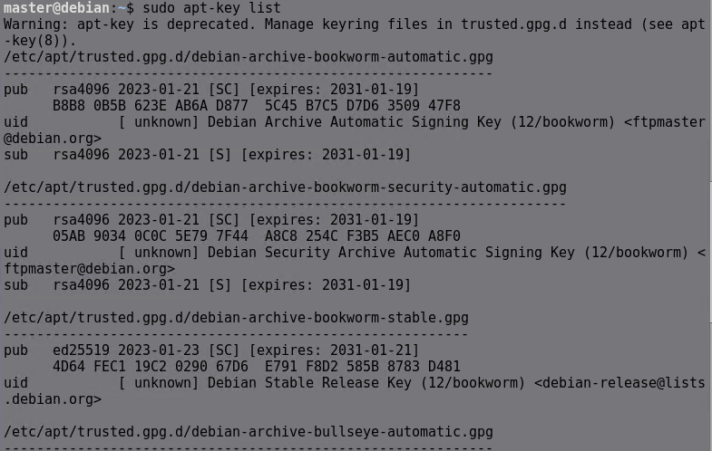


## **Sistem Güncelleme (Debian Tabanlı)**
- Paketler ve işletim sistemi (kernel, distro bileşenleriyle) repolardan güncellenir.
- Linux, güncelleme işlemini update ve upgrade olarak iki fazda ele alır.
Update, sistemde kurulu olan paketlerin versiyonlarını repolarla karşılaştırma işlemidir. Hazırlıktır.
Upgrade ise sistemdeki eski paketlerin repolardaki versiyonlara yükseltilmesi işlemidir.

| Komut             | Parametre            | İşlev                                                                 |
|-------------------|----------------------|-----------------------------------------------------------------------|
| `apt`             | `update`             | Kurulu paketler ile repodakiler arasında versiyonları kıyaslar ve güncelleme için indeks (liste) yaratır. Upgrade işlemine hazırlar. Ardından `apt list --upgradable` komutuyla indeks listelenebilir. |
| `apt`             | `upgrade`            | Kurulu paketlerin güncellenmesini sağlar. Güvenli (soft) seçenektir.  |
| `apt`             | `full-upgrade` (veya `dist-upgrade`) | Upgrade’den farklı olarak paket ve bağımlılıkların, güncelleme için silinmeleri gerekiyorsa silerek yükseltir. Agresif (hard) seçenektir. Dikkat edilmelidir. Kernel ve distro yükseltmeleri bu komut ile yapılır. |

Apt aracının alternatifi olarak aptitude da kullanılabilir. Örn;  `aptitude update` ve `aptitude safe-upgrade` .
`apt install` aptitude ile kurulumunu gerektirir.


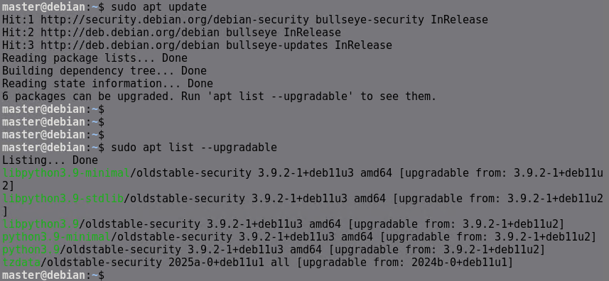


## **APT ile Repo Paketleri Yönetimi**

- Repolardan kurulan paketler /var/cache/apt/archives altına indirilerek kurulurlar.
- Burası için kısacacache adı kullanılır.

| Komut             | Parametre/Argüman      | İşlev                                                                 |
|-------------------|------------------------|-----------------------------------------------------------------------|
| `apt`             | `search <ifade>`       | Belirtilen ifadeyi paket isimleri veya açıklamalarında arar.          |
| `apt`             | `list`                 | Repolardaki tüm paketleri listeler. Çok uzun bir çıktıdır. `grep` ile filtreleme yapılabilir. |
| `apt`             | `list --installed`     | Yüklenmiş olan paketleri listeler.                                    |
| `apt`             | `<paketadı>`           | Belirtilen paketin bilgilerini listeler.                              |
| `apt`             | `show <paketadı>`      | Belirtilen paket hakkında bilgi görüntüler.                           |
| `apt`             | `depends <paketadı>`   | Belirtilen paket için bağıntılıkları (dependencies) görüntüler.        |
| `apt`             | `install <paketadı>`   | Belirtilen paketi kurar. Çoklu paketler de boşlukla ayrılarak kurulabilir. |
| `apt`             | `reinstall <paketadı>` | Belirtilen paketi tekrar kurar.                                       |
| `apt`             | `remove <paketadı>`    | Kurulu paketi kaldırır. Varsayılan olarak konfigürasyon dosyaları kalır. Çoklu paketler de kullanılabilir. |
| `apt`             | `purge <paketadı>`     | Kurulu paketi kaldırır. Konfigürasyon dosyaları da silinir.           |
| `apt`             | `autoremove <paketadı>`| Bağıntılık ihtiyaçlarını karşılamak için kurulmuş fakat artık ihtiyaç duyulmayan paketleri kaldırır. |
| `apt`             | `autoclean`            | İndirilmiş fakat artık repolarda bulunmayan ve ihtiyaç duyulmayacak paketleri cache’den kaldırır. |
| `apt`             | `clean`                | İndirilmiş tüm paketleri cache’den kaldırır. İhtiyaç halinde tekrar indirilmeleri gerekecektir. |


### **`apt search <ifade>`**  

Belirtilen ifadeyi paket isimleri veya açıklamalarında arar.  

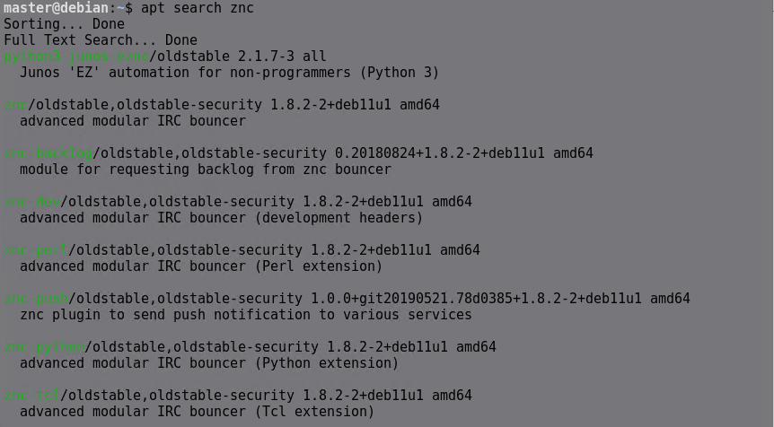  

---

### **`apt list`**  

Repolardaki tüm paketleri listeler. Çok uzun bir çıktıdır. `grep` ile filtreleme yapılabilir.  

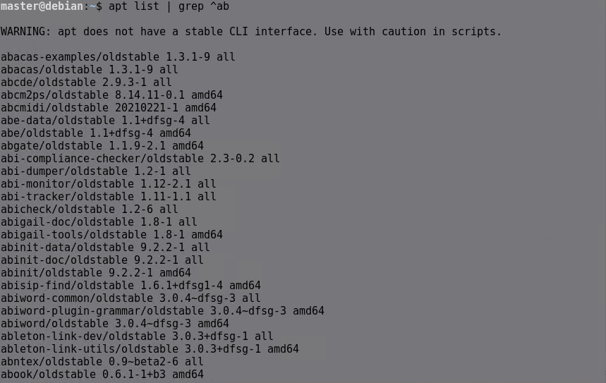  

---

### **`apt list --installed`**  

Yüklenmiş olan paketleri listeler.  

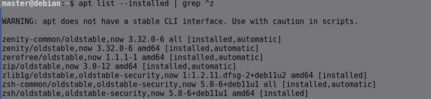  

---

### **`apt show <paketadı>`**  

Belirtilen paket hakkında bilgi görüntüler.  

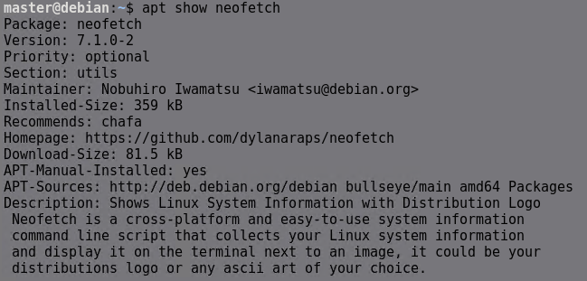  

---

### **`apt depends <paketadı>`**  

Belirtilen paket için bağımlılıkları (**dependencies**) görüntüler.  

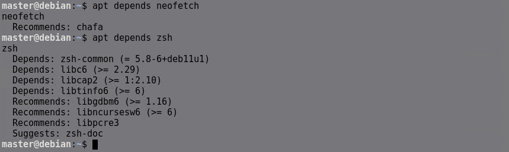  

---

### **`apt install <paketadı>`**  

Belirtilen paketi kurar. İsim aralarında boşluk kullanılarak birden fazla paket kurulabilir.  

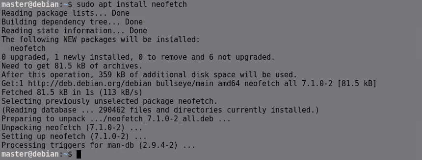  

---

### **`apt reinstall <paketadı>`**  

Belirtilen paketi tekrar kurar.  

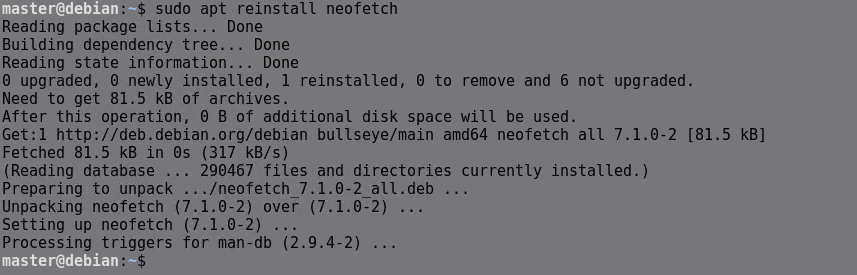  

---

### **`apt remove <paketadı>`**  

Kurulu paketi kaldırır. Varsayılan olarak konfigürasyon dosyaları kalır. Çoklu paketler de kaldırılabilir.  

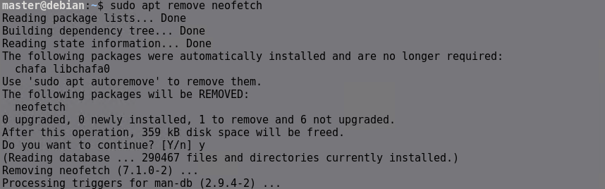  

---

### **`apt purge <paketadı>`**  

Kurulu paketi kaldırır. Konfigürasyon dosyaları da silinir.  

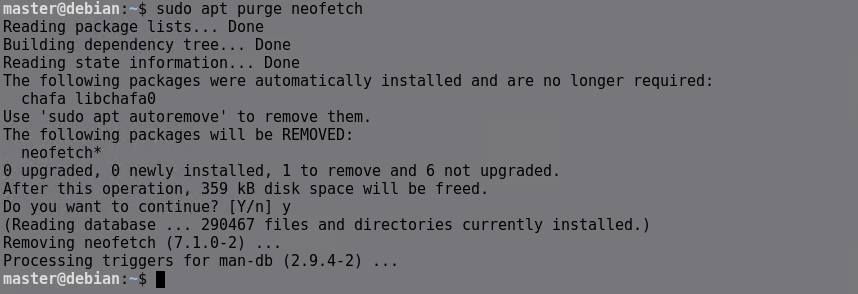  

---

### **`apt autoremove <paketadı>`**  

Bağımlılıkları karşılamak için kurulmuş fakat artık ihtiyaç duyulmayan paketleri kaldırır.  

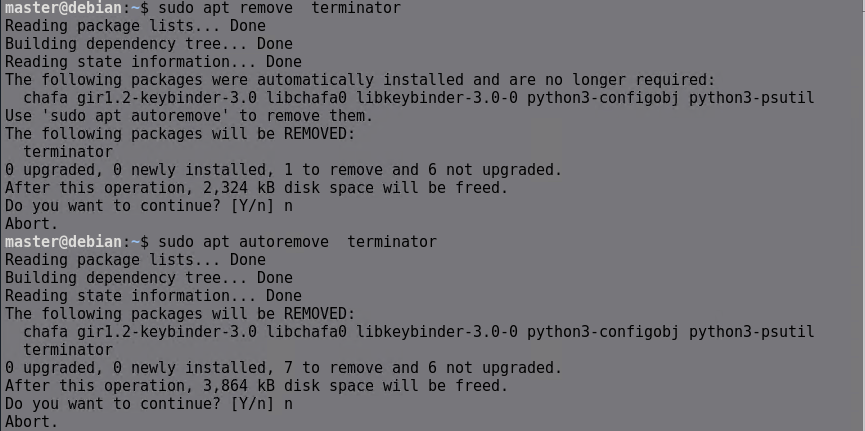  

---

### **`apt autoclean`**  

İndirilmiş fakat artık repolarda bulunmayan ve ihtiyaç duyulmayacak paketleri **cache’den** kaldırır.  

  

---

### **`apt clean`**  

İndirilmiş tüm paketleri **cache’den** kaldırır. Tekrar kullanılmak istenirse yeniden indirilmesi gerekecektir.  

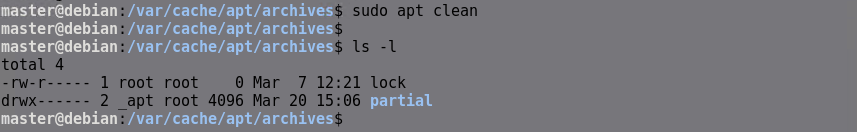  
