# **Paket ve Repo Yönetimi**

## Repo Kavramı
- Repolar, distroların paket dağıtım sunucularıdır. Güncellemer de repolar aracılığıyla yapılır.
- Her distronun kendine özgü resmi, resmi olmayan ve topluluk gibi repoları vardır.
- Her distro için birden fazla repo olabilir. Ve repolar seçilebilirler, eklenebilir, çıkarılabilirlerdir.
- Öntanımlı repolar Debian tabanlı distrolarda genellikle /etc/apt/sources.list dosyasındadır.
- Repolara erişimler, sisteme öntanımlı ve eklenebilir olan key’ler ile sağlanır. Her repo’nun key’i vardır.
Key’ler geçerliliğini veya güncelleğini kaybederse repo erişimi sağlanamaz.
Key’lere keyring adı da verilir; GPG uzantılıdırlar ve key server’lardan temin edilirler.


```
nano /etc/apt/source.list
```
Yukarıdaki komut ile /etc/apt/source.list dosyasını incelediğimizde repoların adreslerini görebiliyoruz.


```
sudo apt-key list 
```
Yukarıdaki komut ile repolara erişim için kullanılan keyleri görüntüledik.


## **Sistem Güncelleme (Debian Tabanlı)**
- Paketler ve işletim sistemi (kernel, distro bileşenleriyle) repolardan güncellenir.
- Linux, güncelleme işlemini update ve upgrade olarak iki fazda ele alır.
Update, sistemde kurulu olan paketlerin versiyonlarını repolarla karşılaştırma işlemidir. Hazırlıktır.
Upgrade ise sistemdeki eski paketlerin repolardaki versiyonlara yükseltilmesi işlemidir.

| Komut             | Parametre            | İşlev                                                                 |
|-------------------|----------------------|-----------------------------------------------------------------------|
| `apt`             | `update`             | Kurulu paketler ile repodakiler arasında versiyonları kıyaslar ve güncelleme için indeks (liste) yaratır. Upgrade işlemine hazırlar. Ardından `apt list --upgradable` komutuyla indeks listelenebilir. |
| `apt`             | `upgrade`            | Kurulu paketlerin güncellenmesini sağlar. Güvenli (soft) seçenektir.  |
| `apt`             | `full-upgrade` (veya `dist-upgrade`) | Upgrade’den farklı olarak paket ve bağımlılıkların, güncelleme için silinmeleri gerekiyorsa silerek yükseltir. Agresif (hard) seçenektir. Dikkat edilmelidir. Kernel ve distro yükseltmeleri bu komut ile yapılır. |

Apt aracının alternatifi olarak aptitude da kullanılabilir. Örn;  `aptitude update` ve `aptitude safe-upgrade` .
`apt install` aptitude ile kurulumunu gerektirir.


## **APT ile Repo Paketleri Yönetimi**

- Repolardan kurulan paketler /var/cache/apt/archives altına indirilerek kurulurlar.
- Burası için kısacacache adı kullanılır.

| Komut             | Parametre/Argüman      | İşlev                                                                 |
|-------------------|------------------------|-----------------------------------------------------------------------|
| `apt`             | `search <ifade>`       | Belirtilen ifadeyi paket isimleri veya açıklamalarında arar.          |
| `apt`             | `list`                 | Repolardaki tüm paketleri listeler. Çok uzun bir çıktıdır. `grep` ile filtreleme yapılabilir. |
| `apt`             | `list --installed`     | Yüklenmiş olan paketleri listeler.                                    |
| `apt`             | `<paketadı>`           | Belirtilen paketin bilgilerini listeler.                              |
| `apt`             | `show <paketadı>`      | Belirtilen paket hakkında bilgi görüntüler.                           |
| `apt`             | `depends <paketadı>`   | Belirtilen paket için bağıntılıkları (dependencies) görüntüler.        |
| `apt`             | `install <paketadı>`   | Belirtilen paketi kurar. Çoklu paketler de boşlukla ayrılarak kurulabilir. |
| `apt`             | `reinstall <paketadı>` | Belirtilen paketi tekrar kurar.                                       |
| `apt`             | `remove <paketadı>`    | Kurulu paketi kaldırır. Varsayılan olarak konfigürasyon dosyaları kalır. Çoklu paketler de kullanılabilir. |
| `apt`             | `purge <paketadı>`     | Kurulu paketi kaldırır. Konfigürasyon dosyaları da silinir.           |
| `apt`             | `autoremove <paketadı>`| Bağıntılık ihtiyaçlarını karşılamak için kurulmuş fakat artık ihtiyaç duyulmayan paketleri kaldırır. |
| `apt`             | `autoclean`            | İndirilmiş fakat artık repolarda bulunmayan ve ihtiyaç duyulmayacak paketleri cache’den kaldırır. |
| `apt`             | `clean`                | İndirilmiş tüm paketleri cache’den kaldırır. İhtiyaç halinde tekrar indirilmeleri gerekecektir. |


### **`apt search <ifade>`**  

Belirtilen ifadeyi paket isimleri veya açıklamalarında arar.  

  

---

### **`apt list`**  

Repolardaki tüm paketleri listeler. Çok uzun bir çıktıdır. `grep` ile filtreleme yapılabilir.  

  

---

### **`apt list --installed`**  

Yüklenmiş olan paketleri listeler.  

  

---

### **`apt show <paketadı>`**  

Belirtilen paket hakkında bilgi görüntüler.  

  

---

### **`apt depends <paketadı>`**  

Belirtilen paket için bağımlılıkları (**dependencies**) görüntüler.  

  

---

### **`apt install <paketadı>`**  

Belirtilen paketi kurar. İsim aralarında boşluk kullanılarak birden fazla paket kurulabilir.  

  

---

### **`apt reinstall <paketadı>`**  

Belirtilen paketi tekrar kurar.  

  

---

### **`apt remove <paketadı>`**  

Kurulu paketi kaldırır. Varsayılan olarak konfigürasyon dosyaları kalır. Çoklu paketler de kaldırılabilir.  

  

---

### **`apt purge <paketadı>`**  

Kurulu paketi kaldırır. Konfigürasyon dosyaları da silinir.  

  

---

### **`apt autoremove <paketadı>`**  

Bağımlılıkları karşılamak için kurulmuş fakat artık ihtiyaç duyulmayan paketleri kaldırır.  

  

---

### **`apt autoclean`**  

İndirilmiş fakat artık repolarda bulunmayan ve ihtiyaç duyulmayacak paketleri **cache’den** kaldırır.  

  

---

### **`apt clean`**  

İndirilmiş tüm paketleri **cache’den** kaldırır. Tekrar kullanılmak istenirse yeniden indirilmesi gerekecektir.  

  


## **ThirdParty Repo yükleme**

Depo bilgisini doğrudan `/etc/apt/sources.list` dosyasına ekleyebilirsiniz ama `/etc/apt/sources.list.d/` dizininde yeni bir .list dosyası oluşturarak eklenmesi daha uygundur.


Daha sonra oluşturduğunuz dosyanın içine yeni reponuzun adresini kapyalayın ve dosyayı kaydedin.


Yeni repoyu kaydettikten sonra `apt upgrade` yaptığımızda GPG error alıyoruz bunun nedeni kaydı yapılan reponun gpg anahtarının tanımlanmamasıdır yani repoya erişilemiyor.

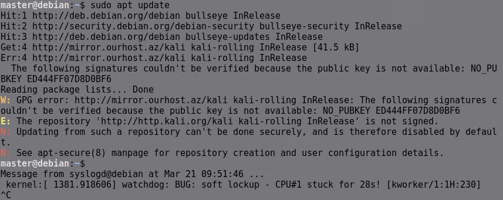

Gerekli anahtarı aşağıdaki gibi eklediğimiz zaman artık repo ulaşılabilir olacaktır.

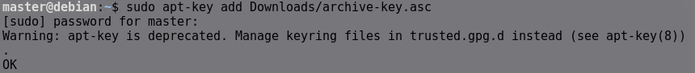

Şimdi yeni repoyu eklemeden ve ekeldikten sonraki `apt upgrade` komutlarının çıktılarını inceleyelim.

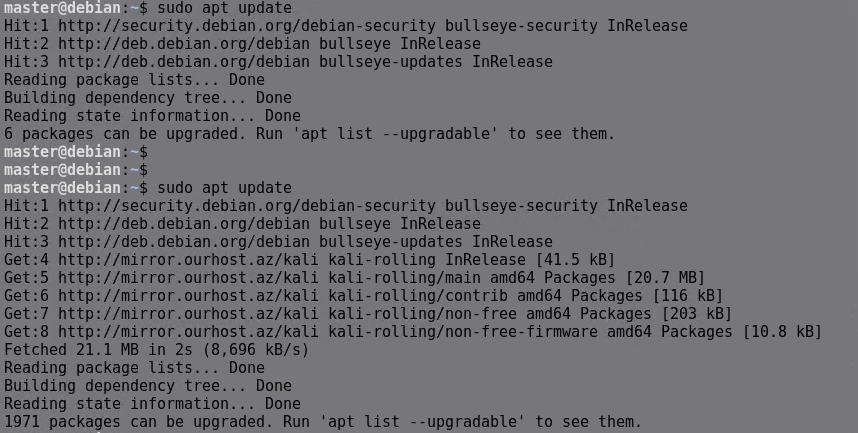

Repolara erişim önceliği belirlemek istiyorsak `/etc/apt/preferences.d/` altına bir dosya oluşturup önceliği belirleyebiliriz.


Dosyanın isimi ve uzantısı önemli değildir. Aşağıdaki gibi yazılmış bir dosyada Pin-Priority değeri yüksek olan domain daha öncelikli olmaktadır.

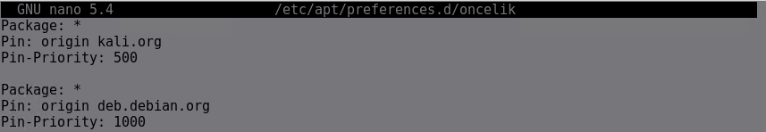

Öncelik işlemi belirtildikden sonra `apt upgrade` komutunun çıktısı aşağıdaki gibidir.

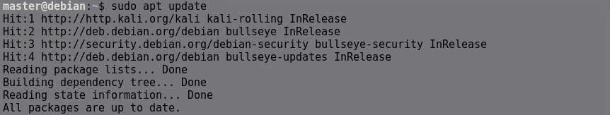


## **GUI Paket Yöneticisi**

Synaptic, Debian ve Ubuntu tabanlı Linux dağıtımları için kullanılan grafik arayüzlü (GUI) bir paket yöneticisidir. Kullanıcı dostu arayüzü sayesinde paketleri kolayca arayabilir, yükleyebilir, güncelleyebilir ve kaldırabilirsin. APT paket yönetim sistemini temel alarak çalışır ve sistemde yüklü olan veya yüklenebilecek tüm paketleri listeleyerek yönetimi basitleştirir. Terminal kullanmadan bağımlılıkları çözme, paket bilgilerini görüntüleme ve sistem güncellemelerini yönetme imkanı sunar. Synaptic, özellikle komut satırına alışkın olmayan kullanıcılar için güçlü ve pratik bir araçtır.

Eğer sisteminizde kurulu değilse aşağıdaki komut ile kurulabilir.

```
apt install synaptic
```

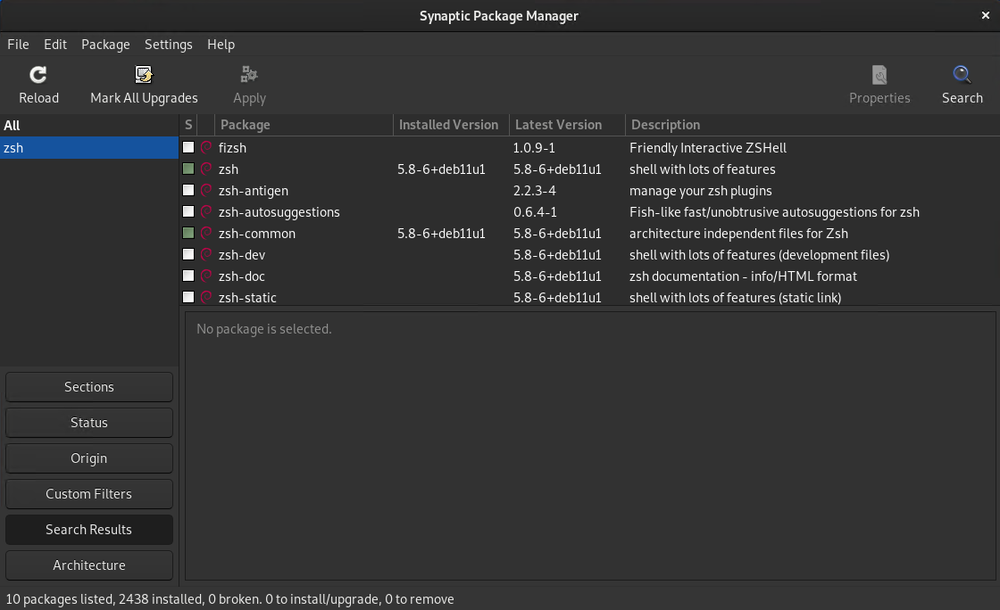

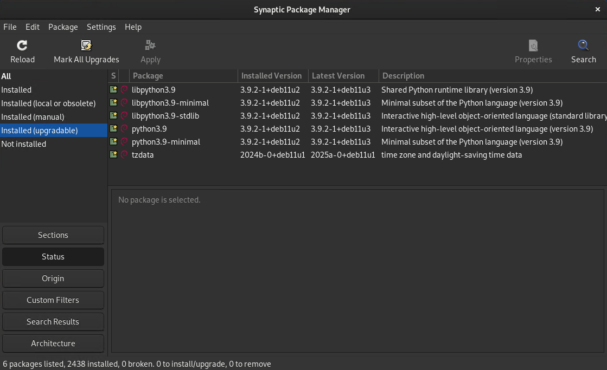

## **Snap**

Snap, Canonical tarafından geliştirilen ve Linux sistemlerinde yazılımların bağımsız olarak paketlenmesini sağlayan bir paket yönetim sistemidir. Geleneksel paket yöneticilerinden farklı olarak, her uygulamanın tüm bağımlılıklarıyla birlikte tek bir paket içinde sunulmasını sağlar, böylece dağıtım bağımsızlığı ve kolay kurulum imkanı sunar.

```
apt install snapd

```

Daha sonra istediğiniz uygulamaları kurabilirsiniz.

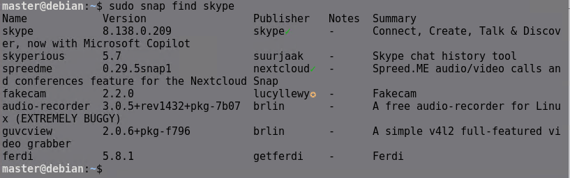

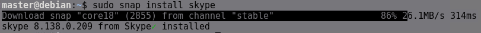

Snap ile indirdiklerinizi görmek için :

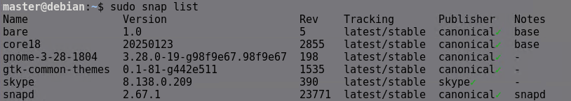

Snap ile indirilenleri kaldırmak için :

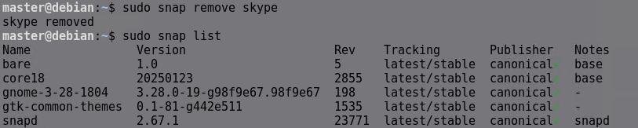

Snap gibi diğer alternatif store'lar arasında Flatpak veya  AppImage da vardır. 


## **CLI ile İndirme**

### **wget**

wget, Linux'ta kullanılan güçlü bir komut satırı aracıdır. Web üzerinden dosya indirmek için kullanılır. HTTP, HTTPS ve FTP protokollerini destekler. 

```
apt install wget
```

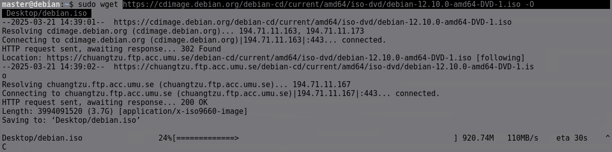

### `wget` Komutunun Parametreleri  

| Parametre | Açıklama |
|-----------|---------|
| `-O dosya_adı` | İndirilen dosyayı belirlenen isimle kaydeder. |
| `-b` | İndirme işlemini arka planda başlatır. |
| `-c` | Kesilen indirmeyi devam ettirir. |
| `-i dosya.txt` | Liste dosyasındaki URL'leri sırayla indirir. |
| `-P klasör_yolu` | Dosyayı belirtilen klasöre kaydeder. |
| `-r` | Web sitesini veya dizini rekürsif (recursive) olarak indirir. |
| `--limit-rate=KB/s` | İndirme hızını sınırlar (örn: `--limit-rate=200k`). |
| `--user-agent="tarayıcı"` | Farklı bir User-Agent tanımlayarak indirme yapar. |
| `--user=kullanici --password=sifre` | Kimlik doğrulama gerektiren sitelere giriş yaparak indirir. |
| `--no-check-certificate` | SSL sertifika hatalarını yoksayar. |
| `-np` | Üst dizinlere çıkmayı engeller (recursive indirme için). |
| `-nd` | Dosyaları alt klasör oluşturmadan kaydeder. |
| `-A uzantı` | Belirli uzantıya sahip dosyaları indirir (örn: `-A pdf`). |
| `-m` | Web sitesinin tamamını indirir (mirror mode). |
| `-q` | Sessiz mod (çıktıyı göstermez). |
| `-nv` | Daha az çıktı gösterir. |
| `-t sayı` | Belirtilen sayıda tekrar deneme yapar (örn: `-t 5`). |
| `--timeout=saniye` | Bağlantı zaman aşımı süresini belirler. |

Daha ayrıntılı bilgi için help ve man dosyalarına bakınız.

---

### **curl**

curl, Linux'ta ve diğer işletim sistemlerinde kullanılan güçlü bir komut satırı aracıdır. Web üzerinden veri alıp göndermek için kullanılır. HTTP, HTTPS, FTP, FTPS, SCP, SFTP, LDAP, ve daha birçok protokolü destekler. curl, veri indirmenin yanı sıra, dosya yükleme (upload) ve web servisleriyle etkileşim kurma gibi işlemleri de gerçekleştirebilir. Ayrıca, HTTP başlıklarını özelleştirme, kimlik doğrulama, SSL sertifika doğrulama gibi bir dizi ileri düzey özellik sunar.


```
apt install curl
```

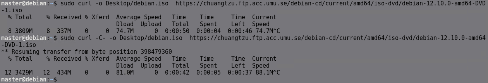


### `curl` Komutunun Parametreleri  

| Parametre | Açıklama |
|-----------|---------|
| `-o dosya_adı` | İndirilen dosyayı belirtilen isimle kaydeder. |
| `-O` | Dosyayı orijinal adıyla kaydeder. |
| `-L` | Yönlendirmeleri takip eder (HTTP 3xx durum kodları). |
| `-u kullanıcı:şifre` | Kimlik doğrulama için kullanıcı adı ve şifre girer. |
| `-d "veri"` | HTTP POST isteği ile veri gönderir. |
| `-X Yöntem` | Belirtilen HTTP yöntemini (GET, POST, PUT, DELETE, vb.) kullanır. |
| `-H "Başlık"` | Belirli bir başlık (header) ekler. |
| `-I` | Sadece HTTP başlıklarını (headers) gösterir. |
| `-i` | Hem HTTP başlıklarını hem de içeriği gösterir. |
| `-F "form_verisi"` | Form verisi gönderir (multipart/form-data). |
| `-k` | SSL sertifika doğrulamasını yoksayar. |
| `-v` | Ayrıntılı (verbose) çıktı gösterir. |
| `-s` | Sessiz mod (progress bar ve hata mesajlarını engeller). |
| `-A "User-Agent"` | Farklı bir User-Agent belirtir. |
| `--limit-rate=KB/s` | İndirme hızını sınırlar (örn: `--limit-rate=200k`). |
| `-T dosya_adı` | Dosya yükler (upload). |
| `-C -` | Kesilen indirmeyi devam ettirir. |
| `-w "%{time_total}"` | İstek süresini çıktı olarak gösterir. |
| `--data-urlencode "parametre=değer"` | URL-encode edilmiş veri gönderir. |
| `--retry sayı` | Belirtilen sayıda tekrar deneme yapar. |


## **Github Repo**

```
apt install git
```
Komutuyla git indirilir daha sonra githubdan indirmek istediğiniz reponun bağlantısını alın 

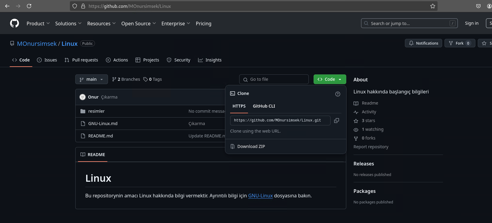

Bağlantıyı kullanarak bulunduğunuz dizinin altına indirme yapabilirsiniz bunun için /opt dizini önerilir.


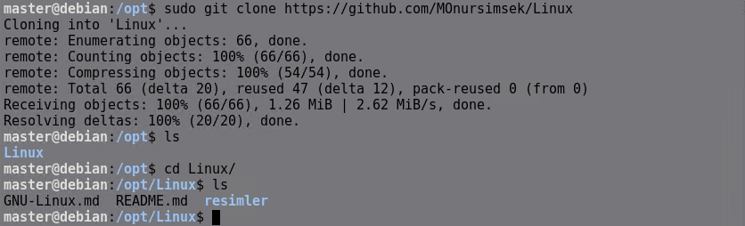